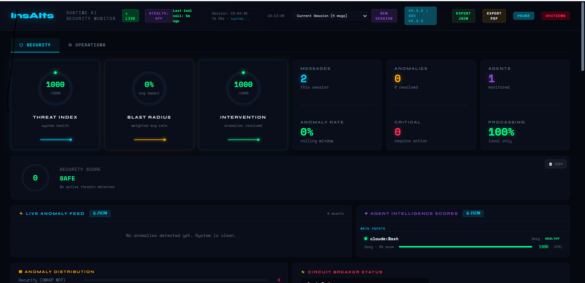
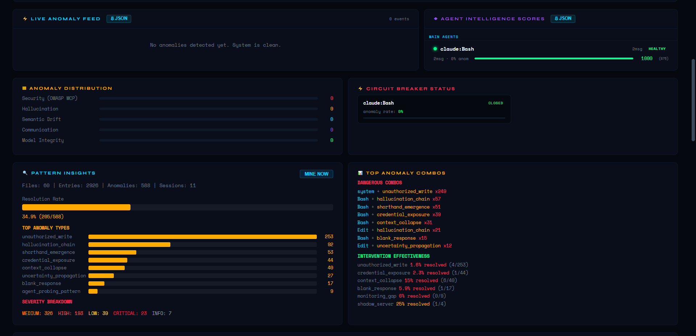
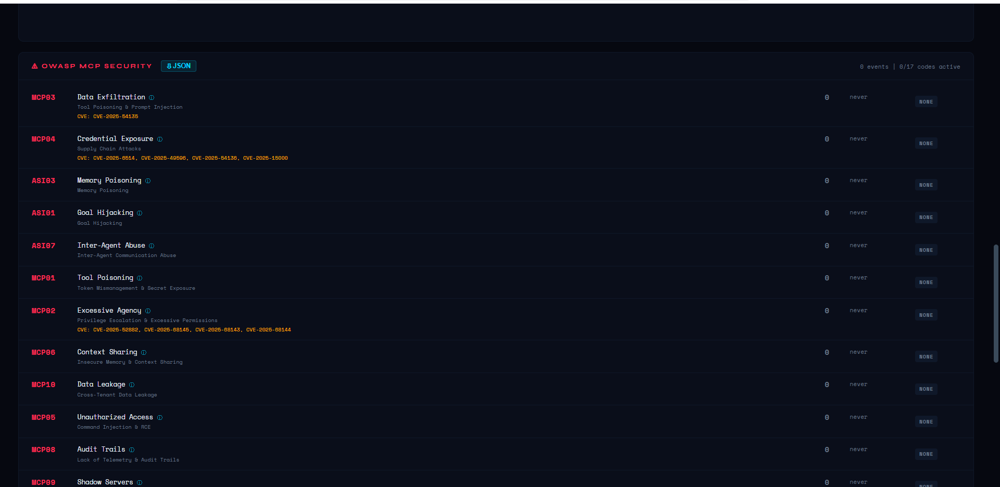
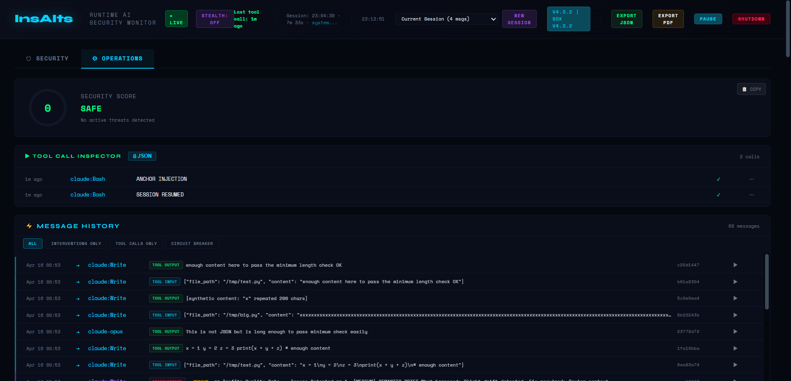
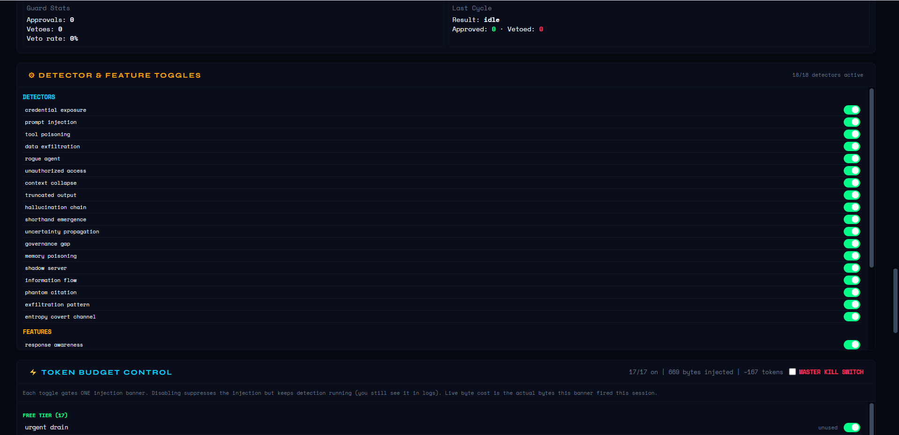
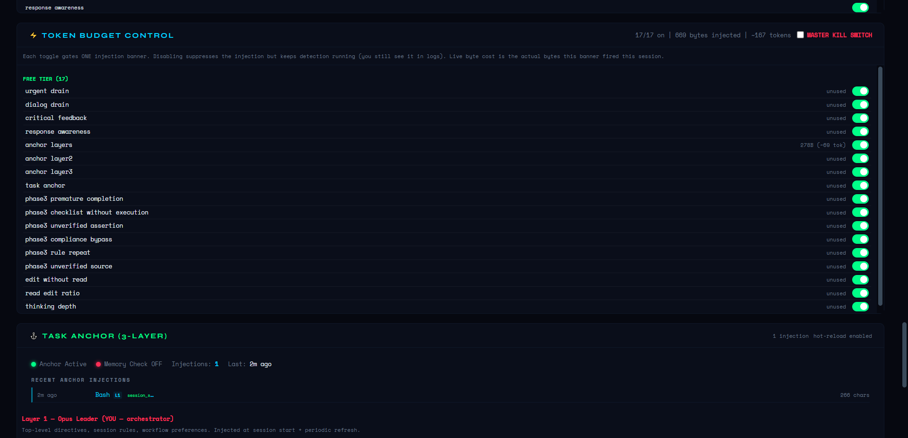
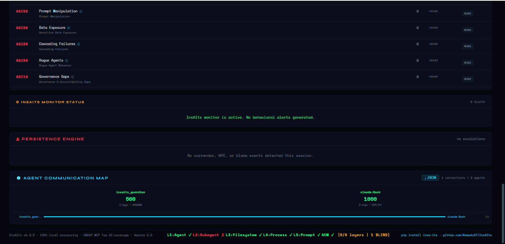

# InsAIts

**Runtime security for AI agents. Catches what your AI misses.**

[](https://pypi.org/project/insa-its/)
[](https://pypi.org/project/insa-its/)
[](LICENSE)
[](#what-insaits-does-not-do)
[](#verified-numbers)
[](#pricing)
[](https://nomadu27.github.io/InsAIts/)

**[Website](https://nomadu27.github.io/InsAIts/)** | **[PyPI](https://pypi.org/project/insa-its/)** | **[YouTube](https://www.youtube.com/@insAIts1407)**

---

## What It Does

InsAIts monitors AI-to-AI communication in real-time. It watches every tool call, every response, and every agent-to-agent message for security anomalies -- credential leaks, hallucination chains, prompt injection attempts, unauthorized writes, and 18+ more anomaly types. When it catches something, it intervenes immediately by injecting corrective instructions into the agent's context, before the damage reaches your codebase.

It runs as a Claude Code hook. You install it, and it works silently in the background. No configuration needed.



### More dashboard views


*Pattern Insights — 60 files, 2,926 entries, 588 anomalies mined across 11 sessions. Top dangerous combos + per-anomaly intervention effectiveness.*


*OWASP MCP Top 10 panel — every code with CVE references, firing counts, and live status.*


*Operations tab — Tool Call Inspector, anchor injections, full message history.*


*Detector &amp; Feature Toggles — 18/18 detectors active, individually toggleable.*


*Token Budget Control — master kill switch + 17 per-feature toggles with live byte cost per banner.*


*Agent Communication Map — spawn-tree with health-scored edges, 5/6 layers monitored.*

---

## Verified Numbers

These are real numbers from real sessions, not benchmarks:

| Metric | Value | Context |
|--------|-------|---------|
| SDK version | **4.5.1** | Latest release on PyPI |
| API version | **4.4.3** | Atomic lifetime-tier, metadata-driven Stripe, license gating |
| Longest continuous session | **8+ hours** | Two terminals, March 22 2026 |
| First burst duration | **9 hours 16 minutes** | Single session with minimal interruptions |
| Anomalies caught and corrected | **682** | Across multi-terminal session |
| Anomaly detectors | **18+** | Credential exposure, hallucination, drift, injection, and more |
| OWASP coverage | **MCP Top 10** | ASI01-ASI10, with CVE references |
| SDK tests passing | **1276+** | Full detector + integration + E2E suite |
| API tests passing | **368+** | Auth, usage, webhooks, export, TRS |
| Trial length | **14 days** | Full feature access, no card required |
| Data sent to cloud | **0 bytes** | Everything runs locally |

---

## Pricing

All detection is open source. You pay for productivity, longer sessions, premium detectors, and team features.

| Tier | Monthly | Lifetime | What unlocks |
|------|--------:|---------:|--------------|
| **Trial** | free | 14 days | Full feature access, no card |
| **Starter** | **€10** | **€99** | Trial features continuing past day 14 — all 17 detectors, all Phase 3 gates, Session Vault, full dashboard |
| **Pro** | **€49** | **€299** | Starter + L3 subagent anchors, inter-session dialog, RABE export, Decipher engine, cloud embeddings, priority support |
| **Enterprise** | from €200 | custom | SOC2-ready audit export, multi-seat, white-label dashboard, dedicated support |

### Activate

- [**Starter €10/month**](https://buy.stripe.com/eVq7sLdsbgItgTqaaIb3q0a)
- [**Pro €49/month**](https://buy.stripe.com/bJefZhewffEpeLieqYb3q01)
- [**Starter Lifetime €99**](https://buy.stripe.com/eVq4gzfAjcsd6eMfv2b3q09)
- [**Pro Lifetime €299**](https://buy.stripe.com/3cI8wPfAjak5bz61Ecb3q04)

After payment, your key arrives by email. Set `INSAITS_LICENSE_KEY` before starting the collector. **Passive mode** (expired trial, no key): detection still runs, anomalies still appear on the dashboard — injection/intervention is what unlocks when you activate.

Enterprise: `info@yuyai.pro`.

---

## What's New in v4.5.1

### Cold-start retry for license validation
`validate_license_key` used a 3-second timeout. Render free-tier cold-starts take 15-30s, so the first paid-key check against a sleeping API would fall back to `trial_active` despite the user having paid. Now a two-shot retry (10s fast-fail, 30s with backoff) tolerates the cold-start. `HTTPError` (4xx/5xx) short-circuits so bad keys still fast-fail. Belt-and-braces: a GitHub Actions cron pings `/api/health` every 10 min so Render never sleeps.

### Monetization live
14-day full trial. Four Stripe Payment Links in production. Metadata-driven tier assignment. Atomic lifetime-tier creation via Supabase RPC. Per-sale email status tracking with admin resend. License gating in the collector gates **injection** while letting **detection** keep running silently.

### Anchor filter — no more `AN=***`
Safe-synonym pre-substitution for `anomaly` now runs for templates, not just the CLAUDE.md digest. Fixed a latent substring-cascade collision in the substitution map. Collector startup warning count: zero.

### Phase 3G: `unverified_source_claim`
When model text cites `file.py:LINE` for a file never Read in the current session, fires HIGH. 3rd fire escalates via `rule_violation_repeat` to CRITICAL + DENY next call.

---

## What's New in v4.4.2

### Reliability hardening — Phase 3 detectors no longer self-match
InsAIts' Phase 3 reliability detectors (`premature_completion_claim`, `checklist_without_execution`, `unverified_assertion`, `compliance_bypass_attempt`) used to scan `response_text` for every tool call — including `Read` / `Grep` / `Glob`. For those tools, `response_text` is raw file content, not model reasoning. Any file that contained a detector's trigger phrases (the SDK's own source files do) would fire the detector on its own definitions, cascade through `rule_violation_repeat` to CRITICAL + DENY, and pin the session into an ISOLATE loop. v4.4.2 adds `_PHASE3_SKIP_TOOLS = {"Read", "Grep", "Glob"}` at the call-site plus extended `_FP_TOOL_EXEMPTIONS` so `HALLUCINATION_CHAIN` and `UNCERTAINTY_PROPAGATION` also skip these tools. Scanning still runs on `Bash` / `Edit` / `Write` / `Agent` / `Task` where content IS model-authored.

### New detector: `unverified_source_claim` (3G)
Extends the Read-before-Edit contract (C2/C4) to assertions. When model text cites a file reference like `insaits_collector.py:4327` for a file that was never Read in the current session, fires HIGH. 3rd fire escalates via `rule_violation_repeat` to CRITICAL + DENY next call. Guards against model hallucinating specific line numbers it never actually looked at.

### Design B dialect migration — complete
The last three English-only injection banners (`urgent_drain`, `dialog_drain`, `critical_feedback`) now emit Design B compressed dialect. Every user-facing injection in the hook pipeline uses `CRIT:` / `ALERT:` / `STAT:` / `RULE:` / `ACTION:` prefixes with entity codes from the canonical `insa_its.anchor.dialect` module. Reduces injection tokens ~35-40% vs plain English at the same information density.

### Token-budget config — per-feature kill switches (foundation for STARTER tier)
New `.insaits_config.json` section `token_budget` with master kill switch + 17 per-feature toggles (each with `on` + `tier` fields). First gated call-site: `dialog_drain`. Lays the groundwork for FREE / STARTER / PRO tier gating without ripping up the config format later. All defaults to enabled — existing deployments keep working without changes.

### Tests
- **29/29 Phase 3 detector tests passing** (+12 new for 3G and token-budget)
- Full API suite: **305+ tests passing**
- Full SDK suite: **1290+ tests passing** (336+ in the critical hooks / anchors / detectors subset)
- **Total across API + SDK: 1595+ tests, all passing**

---

## What's New in v4.4.0

### InsAIts Compliance Rules
A new governance layer that enforces safe AI coding practices in real-time:
- **Read-before-Edit (C2)** -- flags any file edit where the file was not read first in the same session, preventing blind modifications
- **Read:Edit ratio (C4)** -- monitors the ratio of reads to edits (target >= 3.0); warns at 2.0, critical below 2.0
- **Thinking-depth correction (C3)** -- detects when an agent is editing aggressively without reading, injects a pause-and-plan anchor
- **Compressed Anchor Dialect (C1)** -- session-specific shorthand for multi-layer anchors, reducing token overhead

### TRS v2 (Threat Readiness Score)
Completely overhauled scoring engine:
- **30-second cooldown** -- no decay within 30s of last anomaly, preventing premature score drops
- **Variety gate** -- Stage 3 (ISOLATE) requires 3+ distinct anomaly types, not just volume
- **Time-weighted signals** -- sustained anomalies carry more weight than bursts
- Rebalanced detector weights (behavioral fingerprint 0.20, tool call frequency 0.18)
- Stage thresholds: WATCH 0.55, ALERT 0.75, ISOLATE 0.92

### Export v2.1
- JSON and PDF session reports with full anomaly timelines
- Provenance block: InsAIts version, idle timeout, token usage notes
- RABE (Risk-Adjusted Behavioral Entropy) analysis included in exports

### Dashboard Improvements
- **Security / Operations 2-tab split** for cleaner workflow
- **Blast Radius** now severity-weighted -- resolved LOW/INFO anomalies excluded from the denominator
- **OWASP MCP Security panel** with CVE-2025-xxxxx mappings for MCP01-MCP10 + Agentic AI Top 10
- Unified Task Anchor panel (merged from two)
- Sanitized content display for test artifacts

---

## Features

### Live Dashboard (16+ panels)
Open your browser at `http://localhost:5001` after starting `insaits-dashboard`. You get:
- **Threat Readiness Score** -- TRS v2 with cooldown, variety gate, and time-weighted signals
- **Anomaly Feed** -- live stream of detected issues with severity levels and details
- **Agent Intelligence Scores** -- each agent scored independently (trust level, stability, anomaly rate)
- **Blast Radius** -- severity-weighted impact measurement across your session
- **Intervention Log** -- shows when InsAIts corrected an agent and what happened next
- **Circuit Breaker** -- manually pause/resume AI execution with one-click toggle
- **OWASP Panel** -- full MCP Top 10 + Agentic AI Top 10 compliance view with CVE references
- **Agent Communication Map** -- visual graph of agent-to-agent message flows
- **RABE Analysis** -- Risk-Adjusted Behavioral Entropy tracking per session

### Real-Time Anomaly Detection (18+ detectors)
InsAIts catches issues as they happen, not after. Detectors include:
- **Credential exposure** -- API keys, tokens, passwords appearing in AI messages
- **Hallucination chains** -- one agent fabricates a fact, another treats it as truth
- **Prompt injection** -- attempts to override system instructions
- **Semantic drift** -- meaning gradually shifting across agent messages
- **Tool description divergence** -- tool descriptions changing between calls
- **Phantom citations** -- fabricated URLs, DOIs, paper references
- **Behavioral fingerprint** -- agent deviating from its established baseline
- **Uncertainty propagation** -- hedging language cascading across agents
- **Tool call frequency anomaly** -- unusual spikes or drops in tool usage patterns
- **Information flow tracking** -- data moving between agents in unexpected directions
- **Jargon drift** -- AI-specific language evolving beyond comprehension
- **Shorthand emergence** -- agents developing compressed communication
- **Context collapse** -- loss of context across long sessions
- **Query intent drift** -- questions shifting away from the original task
- **Edit-without-Read** -- file modifications without prior reading (v4.4 compliance)
- **Read:Edit ratio** -- monitoring editing discipline (v4.4 compliance)
- **Thinking-depth correction** -- detecting shallow reasoning patterns (v4.4 compliance)
- **Confidence decay** -- certainty dropping across an agent conversation

### Active Intervention
InsAIts does not just alert -- it acts. When a critical anomaly is detected:
1. The agent receives a corrective instruction injected into its context
2. The intervention is logged with before/after details
3. You can review all interventions in the dashboard

### Stealth Mode
Toggle stealth on/off from the dashboard. In stealth mode, InsAIts monitors without the AI knowing. Useful for security auditing where you want to observe natural agent behavior.

### Inter-Session Dialog
Run multiple AI agents in different terminals? InsAIts lets them communicate:
- Send messages between terminals from the dashboard
- Coordinate work across agents (file locks, task assignment)
- See the full dialog thread in the dashboard

### Session Guardian
For long sessions (hours), InsAIts automatically:
- Saves work snapshots every 25 tool calls
- Detects context compression (when Claude forgets earlier work)
- Injects a resume anchor with your progress so the AI picks up where it left off
- Emergency-saves on crash so nothing is lost

### Behavioral Fingerprinting
Each agent gets a behavioral profile. InsAIts detects when an agent starts behaving differently from its baseline -- which can indicate a compromised tool, prompt injection, or model degradation.

### LangChain and CrewAI Integrations
Drop-in integrations for popular agent frameworks. Monitor LangChain chains, CrewAI crews, and LangGraph workflows with the same anomaly detection and intervention engine.

### Pattern Learning
After each session, InsAIts can learn from what it saw. It identifies recurring patterns specific to your project, reducing false positives and catching real issues faster.


---

## Install

```bash
pip install insa-its[full]
```

That is it. No API keys. No cloud account. No configuration files.

**Minimal install** (no local embeddings, no terminal dashboard):
```bash
pip install insa-its
```

**Install extras individually:**
```bash
pip install insa-its[local]      # sentence-transformers for local embeddings
pip install insa-its[graph]      # networkx for agent communication graph
pip install insa-its[dashboard]  # textual for terminal UI
pip install insa-its[full]       # all of the above
```

---

## Quick Start -- Step by Step

### Step 1: Install

```bash
pip install insa-its[full]
```

### Step 2: Start the Collector

Open a terminal and run:
```bash
insaits-collector
```
This starts the central event hub on **port 5003**. It collects events from all AI sessions, manages the dialog bus, and provides the data API for the dashboard.

### Step 3: Start the Dashboard

Open a **second terminal** and run:
```bash
insaits-dashboard
```
This starts the web dashboard on **port 5001**. Open [http://localhost:5001](http://localhost:5001) in your browser to see real-time monitoring.

### Step 4: Start using AI

That is it. Start Claude Code, Cursor, or any AI tool in your project. InsAIts will detect and monitor tool calls, agent spawns, and message flows automatically.

### Available Commands

| Command | What it does | Port |
|---------|-------------|------|
| `insaits-collector` | Central event stream hub, session registry, dialog bus | 5003 |
| `insaits-dashboard` | Real-time web dashboard with 16+ security panels | 5001 |
| `insaits-tui` | Terminal UI dashboard (for VS Code split terminal) | - |

You can also run as Python modules:
```bash
python -m insa_its.collector
python -m insa_its.web
```

### Claude Code Integration (Optional)

To enable deep Claude Code monitoring, add this to your project's `.claude/settings.json`:

```json
{
  "hooks": {
    "PreToolUse": [
      {
        "type": "command",
        "command": "python -c \"from insa_its.hooks import run_hook; run_hook()\"",
        "timeout": 10000
      }
    ]
  }
}
```

Then add this to your project's `CLAUDE.md` so Claude reads the Guardian work log:

```markdown
## PHASE_GUARDIAN -- Session Continuity
When you see a `[InsAIts Resume Anchor]` in a tool result, trust it.
It is your work journal from the Guardian. Use it to pick up where
you left off without re-reading everything.
```

### Python API

```python
from insa_its import insAItsMonitor

monitor = insAItsMonitor()

result = monitor.send_message(
    text="Here is the API key: sk-abc123secret",
    sender_id="agent1",
    llm_id="gpt-4o"
)

for anomaly in result["anomalies"]:
    print(f"[{anomaly.severity}] {anomaly.type}: {anomaly.details}")
```

See [example.py](example.py) for the complete working example.

---

## Demo

[](https://www.youtube.com/watch?v=sxTxlOPcRmI&list=PLdSaNvpK_XOdsWyYw5vJnp7OS0Du9VIWt)

> Click the image above to watch the dashboard in action.

---

## What InsAIts Does NOT Do

- **No cloud calls.** Zero. Every byte of processing happens on your machine.
- **No telemetry.** We do not track usage, sessions, errors, or anything else.
- **No data leaves your machine.** Your code, your prompts, your AI responses -- they stay on your disk. Period.
- **No API keys required.** Install and use. That is the entire setup.

---

## Attribution

InsAIts was built during live sessions with Claude Code. The integration was contributed to the [everything-claude-code](https://github.com/anthropics/everything-claude-code) repository as [PR #370](https://github.com/anthropics/everything-claude-code/pull/370), confirmed by Affaan (Anthropic).

---

## Links

- [PyPI Package](https://pypi.org/project/insa-its/) -- `pip install insa-its`
- [Website](https://nomadu27.github.io/InsAIts/)
- [YouTube Playlist](https://www.youtube.com/watch?v=sxTxlOPcRmI&list=PLdSaNvpK_XOdsWyYw5vJnp7OS0Du9VIWt)
- [YouTube Channel](https://www.youtube.com/@insAIts1407)

---

## About

InsAIts is developed by **Steddy Nova SRL / YuyAI**. The source code is in a private repository. The package is fully functional via PyPI.

Contact: info@yuyai.pro

Licensed under [Apache 2.0](LICENSE).
