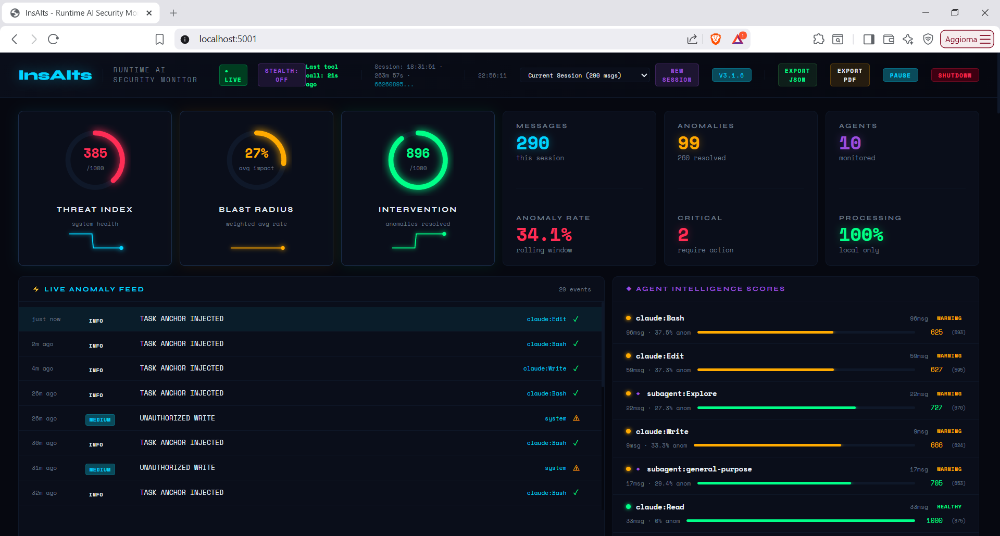
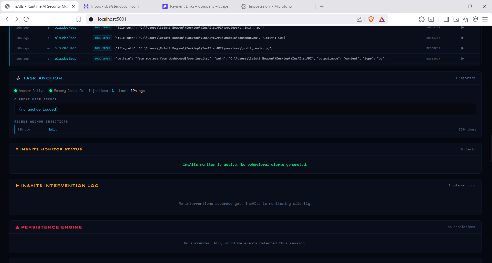

# InsAIts

**Runtime security for AI agents. Catches what your AI misses.**

[](https://pypi.org/project/insa-its/)
[](https://pypi.org/project/insa-its/)
[](LICENSE)
[](#what-insaits-does-not-do)

---

## What It Does

InsAIts monitors AI-to-AI communication in real-time. It watches every tool call, every response, and every agent-to-agent message for security anomalies -- credential leaks, hallucination chains, prompt injection attempts, unauthorized writes, and 19 more anomaly types. When it catches something, it intervenes immediately by injecting corrective instructions into the agent's context, before the damage reaches your codebase.

It runs as a Claude Code hook. You install it, and it works silently in the background. No configuration needed.



---

## Verified Numbers

These are real numbers from real sessions, not benchmarks:

| Metric | Value | Context |
|--------|-------|---------|
| Longest continuous session | **14 hours** | Two terminals, March 22 2026 |
| First burst duration | **9 hours 16 minutes** | Single uninterrupted session |
| Anomalies caught and corrected | **682** | Across that 14-hour session |
| Anomaly types | **23** | Credential exposure, hallucination, drift, injection, and more |
| OWASP coverage | **MCP Top 10** | ASI01-ASI10, with CVE references |
| Data sent to cloud | **0 bytes** | Everything runs locally |

---

## Key Features

- **Real-time anomaly detection** -- 23 types including credential exposure, prompt injection, semantic drift, hallucination chains, and unauthorized file writes
- **Active intervention** -- InsAIts does not just detect. It injects corrective instructions into the AI's context to fix problems before they compound
- **OWASP MCP Top 10 coverage** -- Full mapping to ASI01-ASI10 with CVE references. Enterprise-grade security language
- **Live dashboard** -- Threat index, blast radius, anomaly feed, agent intelligence scores, intervention log, circuit breaker controls
- **Stealth mode** -- Toggle visibility. In stealth, InsAIts monitors without the AI knowing it is being watched
- **Inter-session dialog** -- Send messages between terminals. Coordinate multiple AI agents working on the same project
- **File conflict detection** -- Detects when two agents are about to modify the same file simultaneously
- **Behavioral fingerprinting** -- Tracks how each agent's behavior changes over time. Detects drift from baseline
- **Anchor injection** -- Periodically reinforces security context into long-running agent sessions that tend to drift
- **Pattern learning** -- Learns from past sessions to identify project-specific anomaly patterns



---

## Install

```bash
pip install insa-its
```

That is it. No API keys. No cloud account. No configuration files.

---

## Quick Start

```python
from insa_its import insAItsMonitor

monitor = insAItsMonitor()

result = monitor.inspect(
    "Here is the API key: sk-abc123secret",  # AI response
    "Show me the config"                      # Original prompt
)

if not result.clean:
    for anomaly in result.anomalies:
        print(f"[{anomaly.severity.name}] {anomaly.description}")
```

See [example.py](example.py) for the complete working example.

---

## Demo

[](https://www.youtube.com/watch?v=sxTxlOPcRmI&list=PLdSaNvpK_XOdsWyYw5vJnp7OS0Du9VIWt)

> Click the image above to watch the dashboard in action.

---

## What InsAIts Does NOT Do

- **No cloud calls.** Zero. Every byte of processing happens on your machine.
- **No telemetry.** We do not track usage, sessions, errors, or anything else.
- **No data leaves your machine.** Your code, your prompts, your AI responses -- they stay on your disk. Period.
- **No API keys required.** Install and use. That is the entire setup.

---

## Attribution

InsAIts was built during live sessions with Claude Code. The integration was contributed to the [everything-claude-code](https://github.com/anthropics/everything-claude-code) repository as [PR #370](https://github.com/anthropics/everything-claude-code/pull/370), confirmed by Affaan (Anthropic).

---

## Links

- [PyPI Package](https://pypi.org/project/insa-its/) -- `pip install insa-its`
- [Website](https://nomadu27.github.io/InsAIts-public/)
- [YouTube Playlist](https://www.youtube.com/watch?v=sxTxlOPcRmI&list=PLdSaNvpK_XOdsWyYw5vJnp7OS0Du9VIWt)
- [YouTube Channel](https://www.youtube.com/@insAIts1407)

---

## About

InsAIts is developed by **Steddy Nova SRL**. The source code is in a private repository. The package is fully functional via PyPI.

Licensed under [Apache 2.0](LICENSE).
